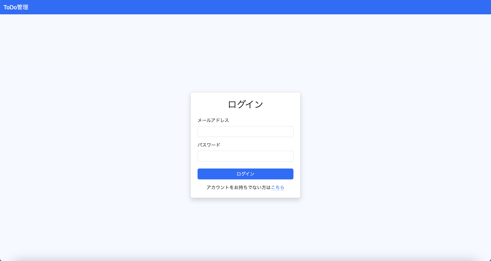
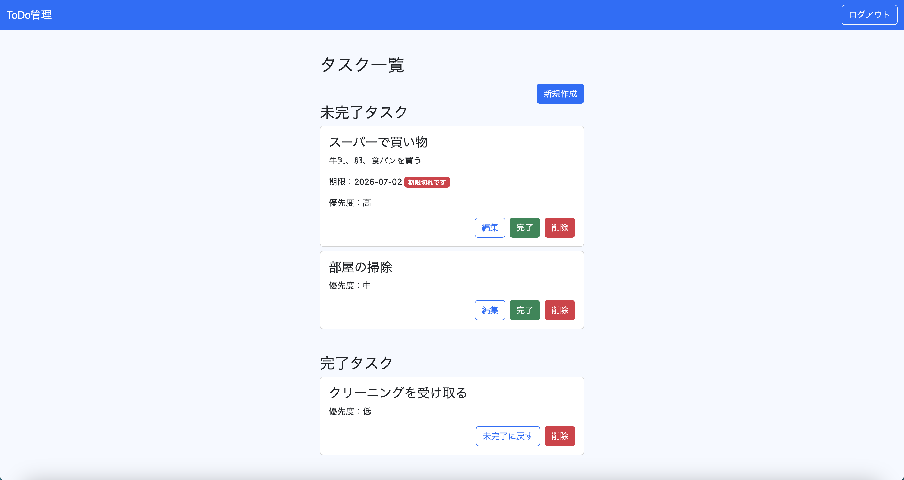
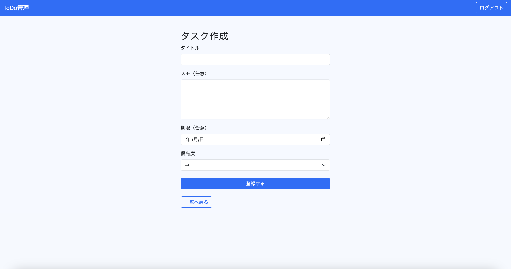

# flask-todo-app

## 目次

- [アプリ概要](#アプリ概要)
- [使用技術](#使用技術)
- [機能一覧](#機能一覧)
- [工夫した点](#工夫した点)
- [セキュリティ・設計面で意識したこと](#セキュリティ設計面で意識したこと)
- [今後の改善予定](#今後の改善予定)
- [起動方法](#起動方法)
- [スクリーンショット](#スクリーンショット)
- [開発について](#開発について)

## アプリ概要

FlaskおよびWebアプリケーション開発の学習のアウトプットとして、認証機能付きToDoアプリを作成しました。
ユーザー登録・ログイン機能に加え、タスクの作成・編集・削除・完了管理を行うことができます。

## 使用技術

### バックエンド
- Python 3.11  
    学習を進めていたPythonを用い、Webアプリケーション開発の理解を深めることを目的として使用しました。
- Flask 3.1  
    ToDoアプリに必要な機能をシンプルに実装でき、アプリケーションの仕組みを理解しながら開発できるため使用しました。
- Flask-Login 0.6  
    ログイン状態の管理や認証機能を安全かつ効率的に実装するため使用しました。
- SQLAlchemy 2.0  
    Pythonからデータベースを安全かつ保守しやすく操作するため、ORMであるSQLAlchemyを使用しました。
- Flask-Migrate 4.1  
    データベーススキーマの変更履歴を管理し、安全にテーブル変更を行うため使用しました。

### データベース
- MySQL 8.0  
    本番環境へのデプロイを見据え、SQLiteではなくMySQLを使用しました。

### フロントエンド
- HTML
- Bootstrap 5.3  
    CRUD機能の実装に注力するため、Bootstrapを利用して画面デザインを効率的に構築しました。

### 開発環境
- macOS
- Docker

### 開発ツール
- Git
- GitHub

## 機能一覧
- ユーザー登録
- ログイン
- ログアウト
- タスクCRUD
- 完了／未完了切り替え
- 期限設定
- 優先度設定

## 工夫した点
- 未完了タスクの並び順を設計  
    タスク一覧画面上で未完了タスクを「期限あり→期限なし」の順に表示し、期限ありのタスクは期限が近い順、その後に優先度（高・中・低）、最後に更新日時の順で並ぶよう設計しました。日常的に利用することを想定し、優先順位の高いタスクが見つけやすい一覧になるよう工夫しました。

- completed_atカラムの追加  
    完了日時を保持するためにcompleted_atカラムを追加しました。完了したタスクは完了日時の新しい順に表示し、最近完了したタスクを確認しやすいようにしています。

- UIの統一  
    Bootstrapを利用して画面全体のデザインを統一しました。操作ボタンは「通常操作＝青」「完了＝緑」「削除＝赤」と色を統一し、直感的に操作できるUIを意識しました。

- SQLAlchemy 2.xの推奨APIを採用  
    SQLAlchemy 2.xで推奨されている`db.select()`を利用してデータベース操作を実装しました。現在推奨されている書き方を採用することで、保守性や可読性を意識しています。

## セキュリティ・設計面で意識したこと
- パスワードのハッシュ化  
    パスワードはハッシュ化して保存し、データベースへ平文のパスワードを保存しないようにしました。

- 機密情報の管理  
    SECRET_KEYやデータベース接続情報は.envで管理し、ソースコードに機密情報を書かない構成としました。

- 認証が必要な画面のアクセス制御  
    ログイン後に利用する機能には@login_requiredを適用し、未認証ユーザーがタスク操作画面へアクセスできないようにしました。認証済みユーザーのみがアプリを利用できる構成としています。

- 認可の実装  
    タスクの取得・編集・削除では、ログイン中のユーザーIDも条件に含めて検索し、他ユーザーのタスクへアクセスできないようにしました。

- SQLインジェクション対策  
    SQLAlchemy ORMを利用し、SQLを文字列連結で組み立てない実装とすることで、SQLインジェクションのリスクを低減しています。

## 今後の改善予定
- Flask-WTFの導入  
    Flask-WTFを導入し、フォームバリデーションやフォーム処理を改善する予定です。

- CSRF対策   
    Flask-WTFのCSRF保護機能を利用し、フォーム送信時のセキュリティを強化する予定です。

- JavaScriptによるUI改善  
    削除確認ダイアログや完了済みタスクの表示切り替えなどを実装し、操作性を向上させる予定です。

## 起動方法

1. リポジトリをクローンします。
```bash
git clone https://github.com/mikan49-iy/flask-todo-app.git
```

2. 仮想環境を作成します。
```bash
python -m venv .venv
```

3. 仮想環境を有効化します。
```bash
source .venv/bin/activate
```

4. 必要なライブラリをインストールします。
```bash
pip install -r requirements.txt
```
※ Python 3.11 を想定しています。

5. `.env.example` を参考に `.env` を作成します。

    **※ 本アプリでは、データベースはDocker上のMySQLを利用しています。**

6. MySQLを起動し、todo_app データベースを作成します。

7. マイグレーションを実行します。
```bash
flask db upgrade
```

8. アプリケーションを起動します。
```bash
flask --app app run
```

## スクリーンショット

### ログイン画面

メールアドレスとパスワードでログインできます。
Bootstrapを使用し、シンプルで見やすいレイアウトを意識しました。



### タスク一覧

未完了タスク・完了タスクを一覧で管理できます。
期限切れ表示や優先度表示により、重要なタスクを把握しやすいUIを意識しました。



### タスク作成画面

タイトル・メモ・期限・優先度を設定してタスクを登録できます。
Bootstrapのフォームコンポーネントを使用し、入力しやすい画面を目指しました。



## 開発について

実装中は公式ドキュメントを参照しながら仕様を確認し、不明点についてはChatGPTも活用して理解を深めながら開発を進めました。